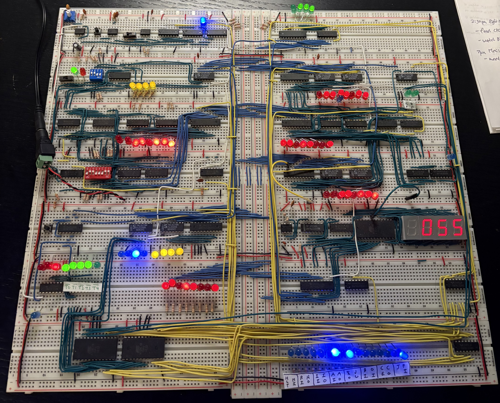

## The Final Build

*The completed 8-bit computer showing ~200 hand-wired connections, logic gates, LEDs, and 7-segment displays. The display shows "055" - output from a running Fibonacci sequence program.*

---

## Technical Specifications

### Hardware components

- **RAM:** 4-bit memory address (16 bytes total)
- **Registers:** Program Counter, A-register, B-register, Instruction register
- **ALU:** 8-bit addition and subtraction
- **Control unit:** 2 EEPROMs mapping instructions to control signals
- **Flags:** JMP, JZ (jump if zero), JC (jump if carry) for branching
- **Clock:** Bistable 555 timer (manual/automatic modes)
- **Output:** Three 7-segment displays + LEDs

### Programs it can run

- Multiplication via repeated addition (e.g., 6 × 8 = 48)
- Fibonacci sequence: 0,1,1,2,3,5,8,13,21,34,55,89,144,233
- Counting loops (0→255, 255→0)
- Conditional branching tests
